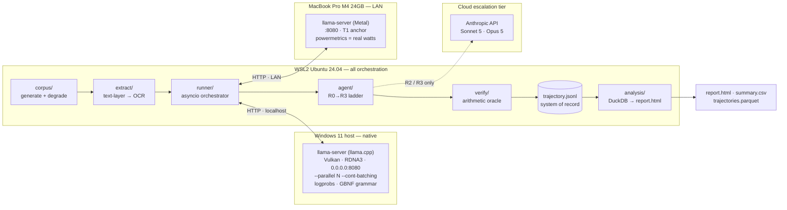
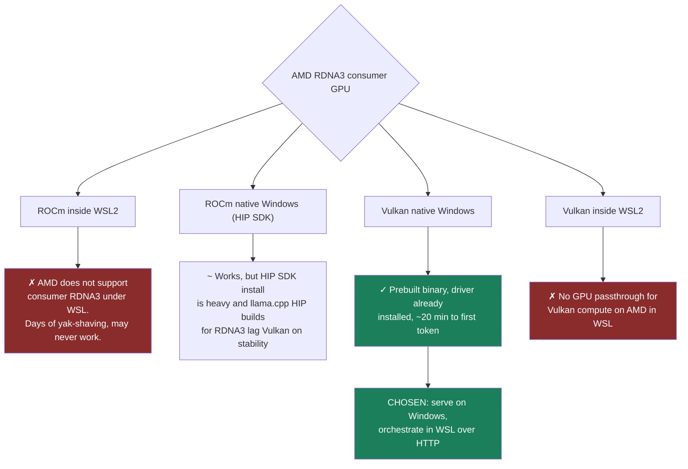
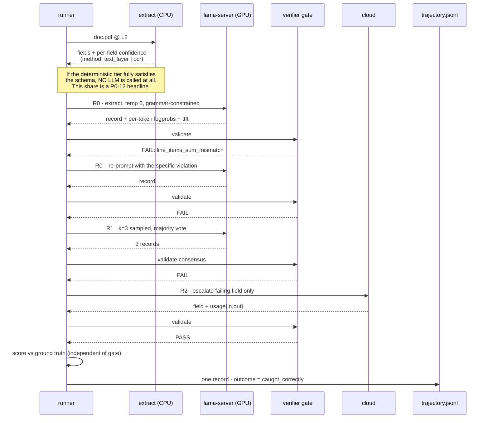
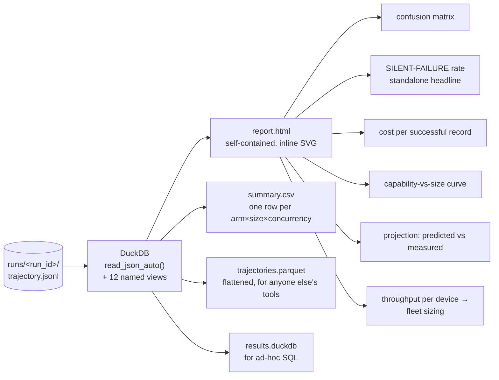
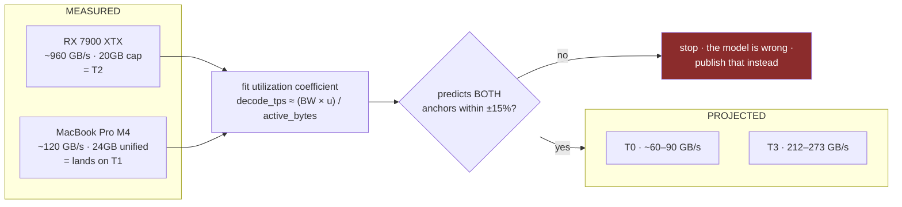
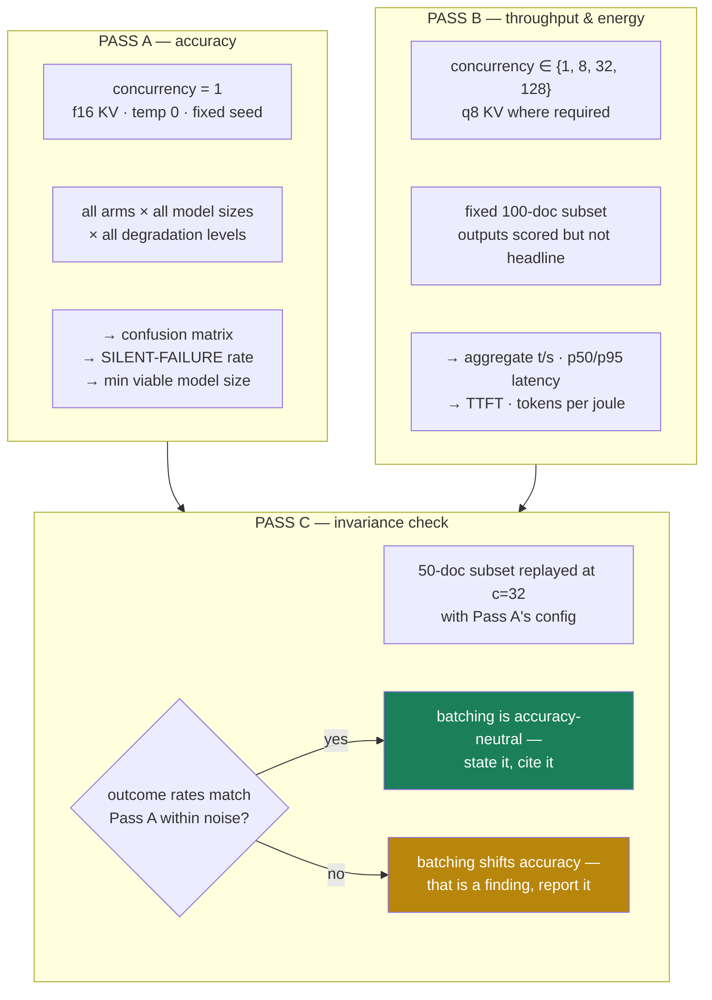
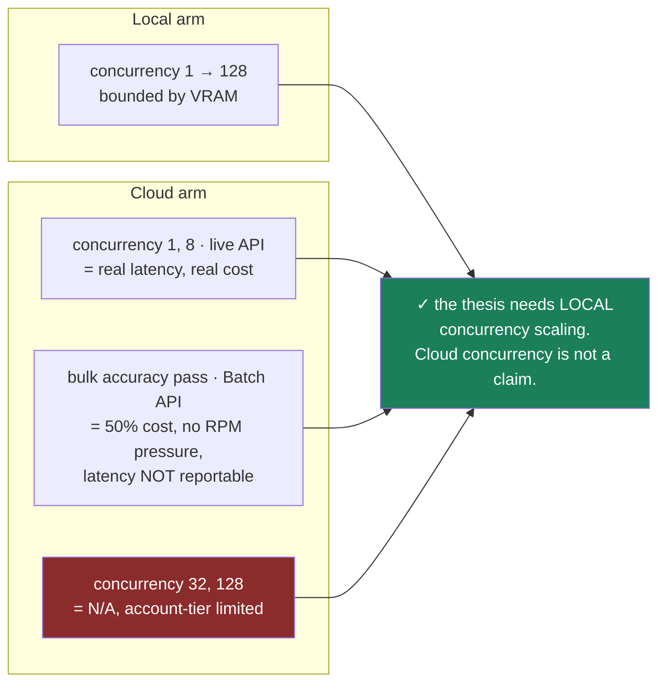
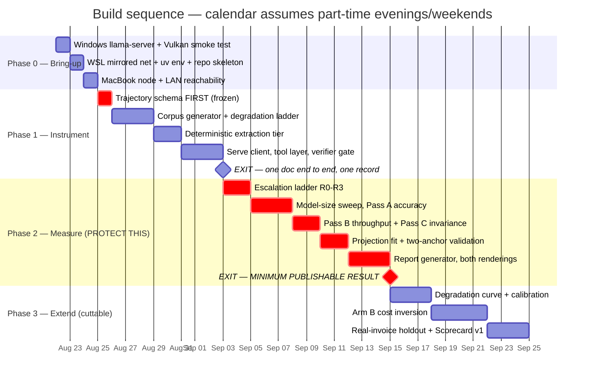
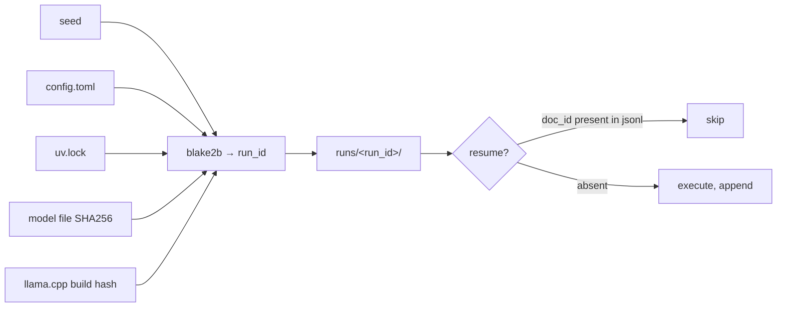

# Edge-First Agentic Inference — Prototype Architecture v1.0

**Implements:** `Edge-First Agentic Inference PRD v0.2`
**Target environment:** single Windows 11 + WSL2 workstation (RDNA3 dGPU) plus one MacBook Pro M4 on a DHCP home network
**Optimizes for:** shortest path from empty repo to a defensible Phase 2 exit gate
**Status:** ready for build

---

## 0. Operating Constraints That Drove This Design

These came from the operator, not from the PRD. Every major choice below traces to one of them.

| # | Constraint | Architectural consequence |
|---|---|---|
| C1 | GPU is an AMD RX 7900 XTX (RDNA3) | vLLM is out. Serving runs **natively on Windows** under llama.cpp/Vulkan; WSL is the client. |
| C2 | Cloud tier uses pay-as-you-go API keys | Real `usage` counts, real dated rates. Introduces a **rate-limit ceiling** on the cloud arm (§6.4). |
| C3 | Review surface must be simple | DuckDB over JSONL + a **single self-contained HTML file**. No server, no ports, no database to administer. |
| C4 | Home network, DHCP, no external tunnel | Everything is LAN-local. The deliverable is a **file**, not a hosted dashboard. Static IPs via router reservation. |
| C5 | Energy is **modeled from spec sheets**, not metered | Tokens-per-joule becomes a *modeled* figure. Scoped and labelled in §7. §7 of the PRD (bandwidth projection) is unaffected. |
| C6 | Accuracy measured at c=1; throughput swept | Cuts the measurement matrix ~4x. An invariance check bridges the two (§6.3). |
| C7 | A MacBook Pro M4 24GB is available | Second **measured** anchor for the projection model, at ~1/8 the test rig's bandwidth. Upgrades T1 from projected to measured. |

---

## 1. System at a Glance



**The one-sentence version:** WSL runs everything except the GPU; the GPU is reached over HTTP; every result lands in one append-only JSONL file; one command turns that file into one HTML page.

---

## 2. Why the Windows/WSL Split

This is the least obvious decision in the document, so it gets its own section.



**The cost of this split is one HTTP hop over loopback** — sub-millisecond, and it is *inside* the measured `latency_ms` for every arm equally, so it cannot bias a comparison.

**The real cost is that WSL has no GPU.** OCR, PDF rasterization, and analysis all run on CPU in WSL. For a 300-document corpus this is fine (minutes, not hours), and it has a hidden benefit: the deterministic tier's cost is measured on CPU, which is exactly how it would run at T0.

### Making the split disappear

Set WSL2 to mirrored networking. This is the single highest-leverage line of configuration in the project:

```ini
# %USERPROFILE%\.wslconfig
[wsl2]
networkingMode=mirrored
```

With this, `localhost:8080` from inside WSL reaches the Windows-side `llama-server` — no host-IP lookup, no firewall rule, no `/etc/hosts` maintenance. Requires Windows 11 22H2+. Without it, you resolve the host IP per boot and add an inbound firewall rule; the runbook covers both paths.

---

## 3. Component Map

| Layer | Choice | Rejected alternative | Why |
|---|---|---|---|
| Serving runtime | **llama.cpp `llama-server`**, Vulkan, Windows-native | vLLM | vLLM has no Windows build and no supported RDNA3 path. llama.cpp gives logprobs, GBNF/JSON-schema grammars, `--parallel` slots, and continuous batching. See ADR-0001 for what this costs. |
| PDF synthesis | **Jinja2 → WeasyPrint** | Playwright/Chromium | Pure Python, deterministic across runs, emits a real text layer. Chromium adds 400MB and version-dependent rendering. |
| Rasterize + degrade | **pypdfium2 + Pillow + NumPy** | ImageMagick | No system packages. Every degradation is a seeded NumPy op, so L0–L4 are bit-reproducible. |
| OCR | **pypdfium2 text layer first, RapidOCR (ONNX) on fallback** | Tesseract | Text-layer-first is a PRD requirement (P0-1, P0-3). RapidOCR pip-installs with no apt, runs CPU, and emits per-line confidence — Tesseract degrades badly on L3/L4. |
| Agent loop | **Hand-rolled asyncio state machine** | LangGraph / CrewAI | The escalation ladder *is* the experiment. A framework would hide the control flow being measured, and its retry logic would contaminate rung accounting. |
| Concurrency | **`asyncio` + `httpx.AsyncClient` + `Semaphore`** | Ray / Celery / Prefect | Two nodes and one queue. A broker or scheduler is pure setup cost here. |
| Config | **TOML (`tomllib`) + Pydantic** | YAML, argparse | Typed, hashable to a `run_id`, no parser dependency. |
| Store | **Append-only JSONL, one file per run** | SQLite / Postgres | Crash-safe, resumable, diffable, greppable. DuckDB queries it in place with zero import step. |
| Analysis | **DuckDB + matplotlib(SVG) + Jinja2** | Streamlit, Jupyter | One command, one file, no running process. See §5. |
| Packaging | **uv + src layout** | poetry, pip-tools | Fastest cold install by a wide margin; lockfile is part of run reproducibility. |

---

## 4. Data Flow — One Document, End to End



The critical property: **the gate decision and the correctness check are computed independently and both written.** `outcome` is derived from their cross-product. `SILENT_FAILURE` = gate passed × answer wrong. Nothing else in the system is allowed to collapse those two axes.

---

## 5. Review and Extraction Surface

The requirement was "a simple means to review and extract results." Three artifacts, one command.

```bash
make report RUN=<run_id>
```

This emits **two HTML renderings from the same DuckDB views** ([ADR-0012](decisions/ADR-0012-report-composition.md)):
`report-operator.html` for running the experiment and defending it to a technical reviewer,
and `report-executive.html` for the client-side decision maker Coastal is pursuing an SOW with.
Neither computes anything — both read the same SQL, so they cannot disagree. The composition
rules for the executive rendering are specified in [`report-composition.md`](report-composition.md).



Design rules for the report:

1. **Self-contained.** Charts are inline `<svg>`, not linked files. It opens from a USB stick, an email attachment, or a laptop across the room. No CDN, no server, nothing to expose through a router that has no tunnel (C4).
2. **Every number carries provenance.** Measured, modeled, or projected — rendered as a visible badge, never inferred from context. Given C5 this is not optional.
3. **The silent-failure rate is the first thing on the page**, on its own, never averaged into anything (PRD D9).
4. **Deterministic.** Same `run_id` → byte-identical report. It is a build output, not a notebook someone ran once.

Ad-hoc digging is `duckdb runs/<id>/results.duckdb` and writing SQL against the named views. Nothing to install, nothing to keep running.

**To view from another device on the LAN** (C4): `make serve-report RUN=<id>` binds a read-only `http.server` to the LAN interface. Because the network is DHCP with no reservation guarantee, the Makefile prints the current IP each time rather than pretending an address is stable. The recommended 5-minute fix is a DHCP reservation in the router for both the workstation and the MacBook, after which `.env` holds fixed addresses.

---

## 6. The Four Measurement Problems, and How Each Is Handled

### 6.1 Projection model validation (PRD §7) — now has two anchors

The PRD asks the projection model to predict the test rig within ±15% before projecting anywhere else. The MacBook makes that materially stronger: it is a second *measured* point at roughly one-eighth the bandwidth.



Two anchors spanning an 8x bandwidth range is a qualitatively different claim from one anchor. A model fitted to a single point and then extrapolated is a line through one dot; fitted to two points an octave apart, it has been *falsifiable at least once*. This is the strongest single upgrade available to the project for half a day of work.

> **Verify before relying on it:** an M4 *base* chip is ~120 GB/s (T1 territory); an M4 *Pro* is ~273 GB/s (T3 bandwidth, T1 capacity). The harness fits from measurement either way, but which tier the anchor lands on changes the story. `make probe-node NODE=mac` reports it.

The MacBook also gives real package power via `powermetrics` at no cost — so **the T1 anchor's tokens-per-joule is measured even though the test rig's is modeled**. That asymmetry must be labelled, not smoothed over.

### 6.2 The concurrency ceiling is KV cache, not compute

llama.cpp divides `--ctx-size` across `--parallel` slots. Concurrency is therefore bounded by memory, not by the scheduler:

```
slots_max = (vram_budget − weights_bytes) / (ctx_per_slot × kv_bytes_per_token)
kv_bytes_per_token = 2 × n_layers × n_kv_heads × head_dim × bytes_per_element
```

At 20GB (D11) with an 8B model at Q4_K_M and f16 KV, 4k per slot, this lands in the low tens of slots — **c=128 is not reachable without quantizing the KV cache and capping per-slot context.**

The honest resolution is to stop conflating two different numbers:

| Term | Meaning | Reported as |
|---|---|---|
| **Offered concurrency** | Requests in flight from the client | The `{1, 8, 32, 128}` axis of P0-9 |
| **Server slots** | `--parallel N` actually resident | Logged per run; the real batching width |

Above `slots`, extra offered load queues rather than batches. Aggregate throughput still rises (the server stays saturated) but per-request latency grows linearly. **Both numbers go in the trajectory record and both appear in the report**, so nobody reads a queued-128 result as a batched-128 result.

`--cache-type-k q8_0 --cache-type-v q8_0` roughly doubles reachable slots. KV quantization is an accuracy confound — which is precisely why accuracy is measured separately (§6.3).

### 6.3 Accuracy and throughput are measured in separate passes (C6)



Pass C costs about an hour and converts an assumption into either a caveat or a result. Note that **either branch is publishable** — this is one of the few places where the experiment cannot lose.

### 6.4 Personal API keys will rate-limit the cloud arm

A new pay-as-you-go account sits in the lowest rate-limit tier. Offering 32 or 128 concurrent requests to the cloud arm from that tier produces 429s, and a retry-backoff loop silently inflates both wall-clock and apparent latency — which would then be reported as a *cloud* characteristic. It isn't; it's an artifact of the account.



Three consequences baked into the design:

1. The cloud-only accuracy pass runs through the **Batch API at 50% cost**. Latency from batch runs is written to the trajectory with a flag and is excluded from every latency chart.
2. Cloud concurrency above 8 is reported as **not measured, account-tier limited** — never silently omitted.
3. A **hard spend guard** aborts the run when cumulative `cloud_usd` crosses a configured ceiling. Expected total spend is **$60–150** across all passes including debugging; the guard exists so a runaway retry loop cannot turn that into a surprise.

---

## 7. Energy Is a Rounding Error — and Proving That Is Worth More Than Measuring It

**Revised.** Tokens per joule was a P0-12 headline. It is now a sensitivity footnote.
See [ADR-0011](decisions/ADR-0011-energy-demoted.md); the reasoning is short enough to restate here.

Tokens per joule is not a forcing function for a buyer choosing between edge and cloud.
The harness's own arithmetic shows why. On a representative Arm A run — 300 invoices,
Qwen3-8B, cascade arm:

| Line | Amount | Share of arm cost |
|---|---|---|
| Cloud escalation (20 × R2 field, 7 × R3 document) | $0.3965 | 97.9% |
| Local energy, modeled at 310W over 620 GPU-seconds | $0.0085 | **2.1%** |
| **Cascade total** | **$0.4050** | |
| Cloud-only comparison | $11.5500 | |

Electricity is 2.1% of the local arm's cost and **0.077% of the gap between the arms**.
The sensitivity is what settles it:

| Power model error | Cost per successful record | Advantage vs cloud-only |
|---|---|---|
| Exact | $0.00137 | 28.3× |
| 3× wrong | $0.00143 | 27.1× |
| **5× wrong** | **$0.00149** | **26.1×** |

A five-fold error moves the headline from 28× to 26×. The PRD's success target is ≥5×.
**No plausible energy error changes a decision**, so precision here buys nothing.

### What replaces it

**Throughput per device** — documents per hour per machine, at each concurrency. That
is what sizes a fleet, and fleet size is what a CFO budgets. It is the procurement-legible
form of the same batching finding the §2 baseline table was reaching for, and Pass B
already measures it. Only the units of the headline changed; no measurement left the harness.

### Where energy still appears

1. **One line in the cost breakdown, with the sensitivity band shown.** Demonstrating
   that electricity is a rounding error retires the "but you pay for the power" objection
   permanently, in one row. This is worth more than a tokens-per-joule chart, which invites
   the objection rather than closing it.
2. **A binary envelope check, not a curve.** Does sustained draw fit the tier's thermal
   and battery budget? That is PRD §11's *operational tolerability* dimension, where power
   is a constraint — IT will block inference on active employee laptops regardless of
   economics — and a constraint is a pass/fail, not a metric.

`cost.energy_source` stays a required field: one enum on a record already being written,
and provenance for a figure that still appears is cheaper to keep than to reconstruct.
The `PowerSource` interface stays because it is already specified. **The smart-plug
recommendation is withdrawn** — it is no longer on any critical path.

---

## 8. Trajectory Contract — Additive Extensions

PRD §8 is the system of record and is treated as binding. The measurement decisions above need provenance that the v0.2 schema does not carry. **All proposed changes are additive** — no field is renamed, retyped, or removed, so anything written against the v0.2 contract still validates.

| Added field | Why it is required |
|---|---|
| `cost.energy_source` | C5. Without it, modeled and measured energy are indistinguishable downstream. **Highest priority of these.** |
| `cost.rate_card_id` | Sonnet 5's intro pricing expires 2026-08-31. Cost per record must pin the rates it was computed against or runs weeks apart aren't comparable. |
| `config.offered_concurrency` + `config.server_slots` | §6.2. Distinguishes batched from queued. |
| `config.kv_cache_dtype` | §6.2/6.3. The accuracy/throughput bridge depends on knowing which pass a record came from. |
| `config.host` `{node_id, tier, backend, bandwidth_gb_s}` | C7. Two nodes now write to the same schema. |
| `attempts[].ttft_ms` | PRD §7 makes prefill/TTFT a scorecard dimension (batch vs. interactive); v0.2 only carries total `latency_ms`. |
| `attempts[].grammar_constrained` | Logprobs under a GBNF/JSON-schema mask are **post-mask** and systematically over-confident. P1-2 calibration is invalid unless it can segment on this. Sharp edge — easy to miss, fatal to the reliability diagram. |
| `attempts[].sampler` | `greedy` vs `k3_vote`. R1 records need to be separable. |
| `attempts[].via_batch_api` | §6.4. Marks records whose latency must be excluded. |
| `document.page_count` | Normalizes cost-per-page against cost-per-document. |

Machine-readable version: `schemas/trajectory.schema.json`. Per PRD §10, this schema is built and frozen **before** any component that writes to it.

---

## 9. Build Sequence



**Phase 0 is roughly one working day of real effort**, spread over three calendar entries because driver installs and reboots don't parallelize. See `runbook-bringup.md` for the exact command sequence.

The bar across Phase 2 is deliberate. Per PRD §10, if effort has to be cut it comes out of Phase 3, and Arm B does not start before m2.

---

## 10. Repository Layout

```
coastal-ai-synthesis/
├─ Makefile                     # the entire operator interface
├─ pyproject.toml               # uv-managed, src layout
├─ .env.example                 # API keys + node addresses
├─ config/
│  ├─ experiment.example.toml   # the sweep definition
│  ├─ rates.toml                # DATED cloud rate cards
│  └─ hardware.toml             # tier ladder + power model coefficients
├─ schemas/
│  ├─ trajectory.schema.json    # PRD §8 + §8 additions — FROZEN FIRST
│  └─ invoice_record.schema.json
├─ docs/
│  ├─ architecture.md           # this file
│  ├─ runbook-bringup.md        # zero to first token
│  ├─ tradeoffs.md              # consolidated, with severities
│  └─ decisions/ADR-00NN-*.md   # PRD §5 delegated decisions
├─ src/edgefirst/
│  ├─ corpus/      # generate.py  templates/  degrade.py
│  ├─ extract/     # textlayer.py  ocr.py  confidence.py
│  ├─ serve/       # client.py  slots.py  logprobs.py
│  ├─ agent/       # ladder.py  prompts/  tools.py
│  ├─ verify/      # oracle.py  checks.py
│  ├─ cloud/       # anthropic.py  rates.py  budget_guard.py
│  ├─ runner/      # orchestrate.py  resume.py  config.py
│  ├─ telemetry/   # power.py  timing.py
│  ├─ projection/  # fit.py  validate.py  tiers.py
│  └─ analysis/    # views.sql  charts.py  export.py
│                  # report_operator.py  report_executive.py  translate.py
├─ runs/<run_id>/  # trajectory.jsonl  report.html  summary.csv  *.parquet
└─ tests/
```

### Operator interface

```
make bringup            # verify both nodes, print a readiness table
make probe-node NODE=   # bandwidth + power characterization of one node
make corpus             # regenerate the corpus from seed
make smoke              # one document, end to end  (Phase 1 exit gate)
make run CFG=           # execute a sweep; resumable; spend-guarded
make report RUN=        # trajectory.jsonl → report.html + csv + parquet
make serve-report RUN=  # LAN-serve the report; prints the current DHCP IP
```

---

## 11. Reproducibility Model



`run_id` is a hash of everything that can change an output. Resume is "read the JSONL, skip what's already there" — no checkpoint file, no state to corrupt, and killing the process mid-run is always safe. This matters more than it sounds on a personal machine that reboots for Windows updates.

Corpus regeneration is a separate seeded step so the same corpus can be reused across runs without regenerating 300 PDFs each time; its SHA is folded into `run_id`.

---

## 12. What This Architecture Deliberately Does Not Do

Per PRD §13, and worth restating because each is a place a build naturally drifts:

- No live CRM. The tool layer is an interface with a simulated implementation.
- No fine-tuning, no LoRA, no quantization sweep, no cross-family leaderboard.
- No auth, no multi-tenancy, no containerization, no CI/CD. This runs on one desk.
- No NPU path.
- No agent framework. The control flow is the measurement.

Adding any of these before m2 trades the minimum publishable result for infrastructure nobody asked for.
